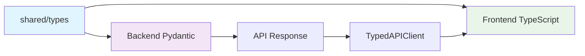

# 타입 안전성 가이드

**백엔드-프론트엔드 간 완볼한 타입 안전 연계 구현 가이드**

## 📋 목차

1. [개요](#개요)
2. [타입 안전성의 이점](#타입-안전성의-이점)
3. [아키텍처 설계](#아키텍처-설계)
4. [구현 방법](#구현-방법)
5. [실제 사용 예시](#실제-사용-예시)
6. [모범 사례](#모범-사례)
7. [문제 해결](#문제-해결)

## 개요

이 가이드는 통합 자동화 플랫폼에서 백엔드(Python/FastAPI)와 프론트엔드(React/TypeScript) 간의 완볼한 타입 안전성을 구현하는 방법을 설명합니다.

### 주요 목표

- ✅ 컴파일 타임에 타입 에러 검출
- ✅ API 요청/응답의 타입 일관성 보장
- ✅ 자동 완성 및 IntelliSense 지원
- ✅ 리팩토링 시 안전성 확보
- ✅ 런타임 에러 최소화

## 타입 안전성의 이점

### 1. 개발 생산성 향상

```typescript
// ❌ 기존 방식: 타입 정보 없음
const response = await fetch('/api/devices');
const data = await response.json(); // any 타입

// ✅ 타입 안전 방식
const devices = await apiClient.get('/api/v1/devices');
// 자동으로 APIResponse<PaginatedResponse<Device>> 타입 추론
```

### 2. 런타임 에러 방지

```typescript
// ❌ 에러 발생 가능
device.connectionType = 'FTP'; // 컴파일 에러 없이 런타임 에러

// ✅ 컴파일 타임 에러 검출
device.connectionType = 'FTP'; // Error: Type '"FTP"' is not assignable to type 'ConnectionType'
```

### 3. 리팩토링 안전성

```typescript
// Device 타입에 새 필드 추가 시
interface Device {
  // ... 기존 필드
  location?: string; // 새 필드
}

// 모든 사용 지점에서 자동으로 타입 업데이트
```

## 아키텍처 설계

### 전체 구조

```
통합 자동화 플랫폼
│
├── shared/                    # 공유 타입 라이브러리
│   ├── types/                # 타입 정의
│   ├── utils/                # 유틸리티 함수
│   └── config/               # 상수 정의
│
├── backend/ (Python)          # FastAPI 백엔드
│   ├── models/               # Pydantic 모델
│   ├── api/                  # API 라우터
│   └── services/             # 비즈니스 로직
│
└── frontend/ (TypeScript)     # React 프론트엔드
    ├── src/components/       # UI 컴포넌트
    ├── src/services/         # API 서비스
    └── src/types/            # shared/ 타입 사용
```

### 타입 흐름



## 구현 방법

### 1. 공유 타입 정의

#### Device 타입 예시

```typescript
// shared/types/device.ts
export type DeviceType = 'SERVER' | 'NETWORK_DEVICE' | 'DESKTOP';
export type ConnectionType = 'SSH' | 'TELNET' | 'RDP' | 'VNC';
export type DeviceStatus = 'ONLINE' | 'OFFLINE' | 'UNKNOWN' | 'ERROR';

export interface Device {
  id: string;
  name: string;
  type: DeviceType;
  connectionType: ConnectionType;
  host: string;
  port: number;
  status: DeviceStatus;
  groups: string[];
  tags: Record<string, string>;
  metadata: Record<string, any>;
  lastConnected?: string;
}

export interface CreateDeviceRequest {
  name: string;
  type: DeviceType;
  connectionType: ConnectionType;
  host: string;
  port: number;
  groups?: string[];
  tags?: Record<string, string>;
  credentials: {
    username: string;
    password?: string;
    sshKeyPath?: string;
  };
}

export interface DeviceExecutionRequest {
  deviceId: string;
  command: string;
  timeout?: number;
}

export interface DeviceExecutionResponse {
  deviceId: string;
  status: 'SUCCESS' | 'FAILURE' | 'TIMEOUT';
  output: string;
  error?: string;
  executionTime: number;
}
```

### 2. API 엔드포인트 타입 정의

```typescript
// shared/types/api.ts
export interface APIEndpoints {
  '/api/v1/devices': {
    GET: {
      params?: PaginationParams & FilterParams;
      response: APIResponse<PaginatedResponse<Device>>;
    };
    POST: {
      body: CreateDeviceRequest;
      response: APIResponse<Device>;
    };
  };
  
  '/api/v1/devices/:id': {
    GET: {
      response: APIResponse<Device>;
    };
    PUT: {
      body: Partial<CreateDeviceRequest>;
      response: APIResponse<Device>;
    };
    DELETE: {
      response: APIResponse<void>;
    };
  };
  
  '/api/v1/devices/:id/execute': {
    POST: {
      body: DeviceExecutionRequest;
      response: APIResponse<DeviceExecutionResponse>;
    };
  };
}
```

### 3. 타입 안전 API 클라이언트

```typescript
// shared/utils/api-client.ts
export class TypedAPIClient {
  async request<
    TPath extends keyof APIEndpoints,
    TMethod extends keyof APIEndpoints[TPath]
  >(
    path: TPath,
    method: TMethod,
    options: {
      params?: ExtractEndpointParams<TPath, TMethod>;
      body?: ExtractEndpointBody<TPath, TMethod>;
    } = {}
  ): Promise<ExtractEndpointResponse<TPath, TMethod>> {
    // 구현
  }

  // 편의 메서드
  async get<TPath extends keyof APIEndpoints>(
    path: TPath,
    options?: { params?: ExtractEndpointParams<TPath, 'GET'> }
  ) {
    return this.request(path, 'GET' as any, options);
  }

  async post<TPath extends keyof APIEndpoints>(
    path: TPath,
    options?: { body?: ExtractEndpointBody<TPath, 'POST'> }
  ) {
    return this.request(path, 'POST' as any, options);
  }
}
```

### 4. 백엔드 Pydantic 모델

```python
# backend/models/device.py
from enum import Enum
from typing import Optional, Dict, Any, List
from pydantic import BaseModel

class DeviceType(str, Enum):
    SERVER = "SERVER"
    NETWORK_DEVICE = "NETWORK_DEVICE"
    DESKTOP = "DESKTOP"

class ConnectionType(str, Enum):
    SSH = "SSH"
    TELNET = "TELNET"
    RDP = "RDP"
    VNC = "VNC"

class DeviceStatus(str, Enum):
    ONLINE = "ONLINE"
    OFFLINE = "OFFLINE"
    UNKNOWN = "UNKNOWN"
    ERROR = "ERROR"

class Device(BaseModel):
    id: str
    name: str
    type: DeviceType
    connection_type: ConnectionType
    host: str
    port: int
    status: DeviceStatus
    groups: List[str] = []
    tags: Dict[str, str] = {}
    metadata: Dict[str, Any] = {}
    last_connected: Optional[str] = None

class CreateDeviceRequest(BaseModel):
    name: str
    type: DeviceType
    connection_type: ConnectionType
    host: str
    port: int
    groups: Optional[List[str]] = []
    tags: Optional[Dict[str, str]] = {}
    credentials: Dict[str, Any]

class DeviceExecutionRequest(BaseModel):
    device_id: str
    command: str
    timeout: Optional[int] = 30

class DeviceExecutionResponse(BaseModel):
    device_id: str
    status: str
    output: str
    error: Optional[str] = None
    execution_time: int
```

### 5. 프론트엔드 사용

```typescript
// frontend/src/services/deviceService.ts
import { apiClient } from './apiClient';
import type { Device, CreateDeviceRequest, DeviceExecutionRequest } from '@automation-platform/shared';

export class DeviceService {
  async getDevices(params?: { page?: number; limit?: number }) {
    return apiClient.get('/api/v1/devices', { params });
  }

  async createDevice(deviceData: CreateDeviceRequest) {
    return apiClient.post('/api/v1/devices', { body: deviceData });
  }

  async executeCommand(deviceId: string, command: string) {
    return apiClient.post('/api/v1/devices/:id/execute', {
      params: { id: deviceId },
      body: { deviceId, command }
    });
  }
}
```

## 실제 사용 예시

### 1. 장비 관리 컴포넌트

```typescript
// frontend/src/components/DeviceList.tsx
import React, { useEffect, useState } from 'react';
import type { Device } from '@automation-platform/shared';
import { DeviceService } from '../services/deviceService';

export const DeviceList: React.FC = () => {
  const [devices, setDevices] = useState<Device[]>([]);
  const [loading, setLoading] = useState(true);
  const deviceService = new DeviceService();

  useEffect(() => {
    const loadDevices = async () => {
      try {
        const response = await deviceService.getDevices({
          page: 1,
          limit: 20
        });
        
        if (response.success) {
          setDevices(response.data.items); // 타입 안전
        }
      } catch (error) {
        console.error('Failed to load devices:', error);
      } finally {
        setLoading(false);
      }
    };

    loadDevices();
  }, []);

  const handleDeviceAction = async (device: Device, command: string) => {
    try {
      const result = await deviceService.executeCommand(device.id, command);
      
      if (result.success) {
        console.log('Command output:', result.data.output);
      }
    } catch (error) {
      console.error('Command execution failed:', error);
    }
  };

  if (loading) return <div>Loading...</div>;

  return (
    <div className="device-list">
      {devices.map(device => (
        <div key={device.id} className="device-card">
          <h3>{device.name}</h3>
          <p>Type: {device.type}</p>
          <p>Status: {device.status}</p>
          <p>Host: {device.host}:{device.port}</p>
          
          <button 
            onClick={() => handleDeviceAction(device, 'ls -la')}
            disabled={device.status !== 'ONLINE'}
          >
            Execute Command
          </button>
        </div>
      ))}
    </div>
  );
};
```

### 2. 장비 생성 폼

```typescript
// frontend/src/components/CreateDeviceForm.tsx
import React, { useState } from 'react';
import type { 
  CreateDeviceRequest, 
  DeviceType, 
  ConnectionType 
} from '@automation-platform/shared';
import { validateDeviceData } from '@automation-platform/shared/utils';
import { DeviceService } from '../services/deviceService';

export const CreateDeviceForm: React.FC = () => {
  const [formData, setFormData] = useState<Partial<CreateDeviceRequest>>({
    type: 'SERVER',
    connectionType: 'SSH',
    port: 22,
    groups: [],
    tags: {},
    credentials: {
      username: ''
    }
  });
  
  const [errors, setErrors] = useState<string[]>([]);
  const deviceService = new DeviceService();

  const handleSubmit = async (e: React.FormEvent) => {
    e.preventDefault();
    
    // 유효성 검사
    const validation = validateDeviceData(formData);
    if (!validation.valid) {
      setErrors(validation.errors);
      return;
    }
    
    try {
      const response = await deviceService.createDevice(
        formData as CreateDeviceRequest // 검증 후 안전한 캠스팅
      );
      
      if (response.success) {
        console.log('Device created:', response.data);
        // 성공 처리
      }
    } catch (error) {
      console.error('Failed to create device:', error);
    }
  };

  return (
    <form onSubmit={handleSubmit}>
      <div>
        <label>Device Name:</label>
        <input
          type="text"
          value={formData.name || ''}
          onChange={(e) => setFormData(prev => ({
            ...prev,
            name: e.target.value
          }))}
          required
        />
      </div>
      
      <div>
        <label>Device Type:</label>
        <select
          value={formData.type}
          onChange={(e) => setFormData(prev => ({
            ...prev,
            type: e.target.value as DeviceType
          }))}
        >
          <option value="SERVER">Server</option>
          <option value="NETWORK_DEVICE">Network Device</option>
          <option value="DESKTOP">Desktop</option>
        </select>
      </div>
      
      <div>
        <label>Connection Type:</label>
        <select
          value={formData.connectionType}
          onChange={(e) => setFormData(prev => ({
            ...prev,
            connectionType: e.target.value as ConnectionType
          }))}
        >
          <option value="SSH">SSH</option>
          <option value="TELNET">Telnet</option>
          <option value="RDP">RDP</option>
          <option value="VNC">VNC</option>
        </select>
      </div>
      
      {/* 에러 표시 */}
      {errors.length > 0 && (
        <div className="errors">
          {errors.map((error, index) => (
            <p key={index} className="error">{error}</p>
          ))}
        </div>
      )}
      
      <button type="submit">Create Device</button>
    </form>
  );
};
```

### 3. WebSocket 이벤트 처리

```typescript
// frontend/src/hooks/useDeviceEvents.ts
import { useEffect } from 'react';
import type { WebSocketEvents } from '@automation-platform/shared';

export const useDeviceEvents = (onDeviceUpdate: (deviceId: string, status: string) => void) => {
  useEffect(() => {
    const ws = new WebSocket('ws://localhost:8000/ws');
    
    ws.onmessage = (event) => {
      const message: {
        event: keyof WebSocketEvents;
        data: WebSocketEvents[keyof WebSocketEvents];
      } = JSON.parse(event.data);
      
      switch (message.event) {
        case 'device.status.update':
          const deviceData = message.data as WebSocketEvents['device.status.update'];
          onDeviceUpdate(deviceData.deviceId, deviceData.status);
          break;
          
        case 'device.execution.output':
          const executionData = message.data as WebSocketEvents['device.execution.output'];
          console.log('Command output:', executionData.output);
          break;
      }
    };
    
    return () => {
      ws.close();
    };
  }, [onDeviceUpdate]);
};
```

## 모범 사례

### 1. 타입 안전 에러 처리

```typescript
// 에러 타입 정의
export class APIError extends Error {
  constructor(
    public status: number,
    public code: string,
    message: string,
    public details?: any
  ) {
    super(message);
    this.name = 'APIError';
  }
}

// 에러 처리 허
```